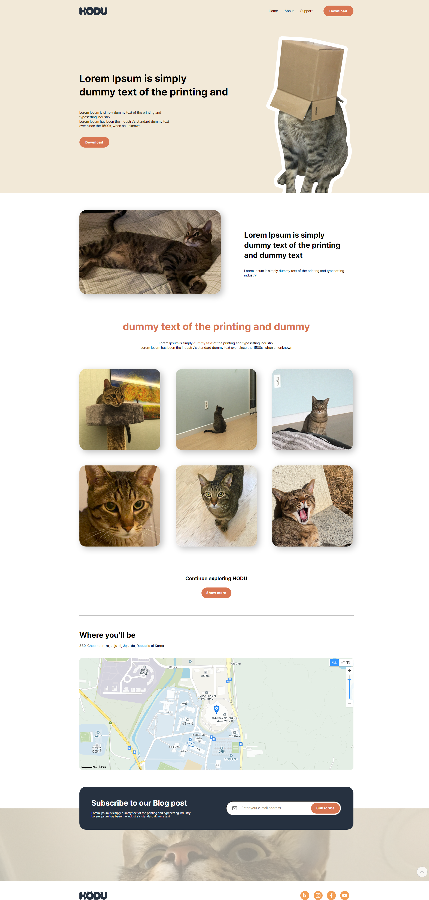
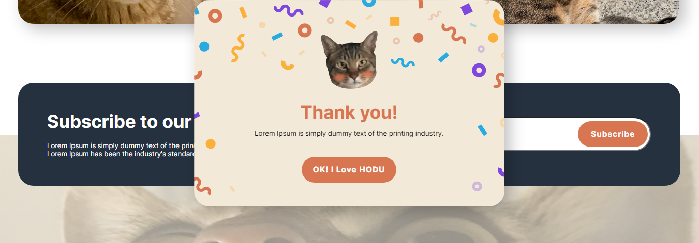
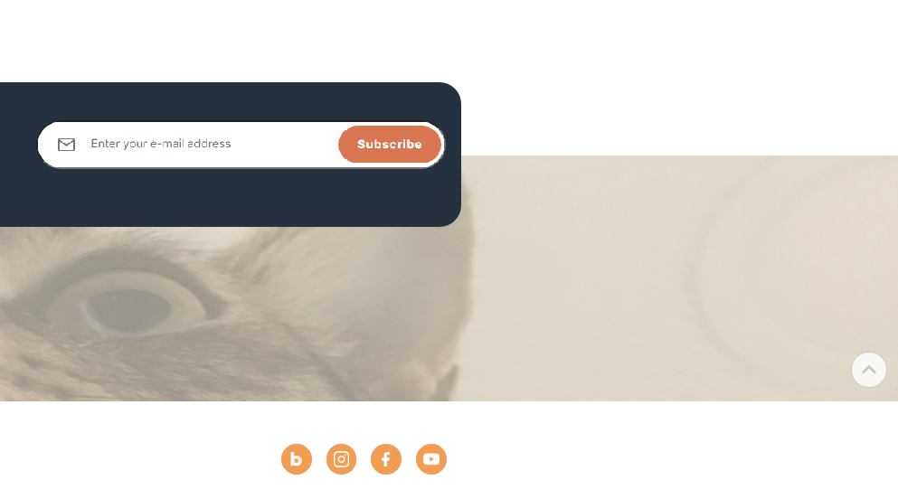

# ESTsoft 오르미 6기 FE Project

## 구현 기능

[피그마 사이트 링크](<https://www.figma.com/design/s9RCnA6dSi3QHHeMDFHKE6/EST-%EC%98%A4%EB%A5%B4%EB%AF%B8(BE)_HTML%2FCSS%2FJS?node-id=104924-12&t=DkHqKMa1PBxYw4n3-0>)

1. 피그마를 참고하여 페이지 구현을 합니다.
2. 스크롤시 헤더가 고정되게 합니다. (단, 처음에는 고정된 상태가 아닙니다.)
3. 스크롤 탑 버튼을 구현합니다. 
    1. 스크롤 탑 버튼은 스크롤시 나타납니다.
    2. 스크롤 탑 버튼은 푸터 아래로 내려가지 않습니다.
    3. 스크롤 탑 버튼을 누르면 스크롤이 최상단으로 올라갑니다. (단, 부드럽게 올라가야 합니다.)
4. 구독하기 모달창
    1. 이메일을 입력하고 `Subscribe` 버튼을 클릭하면 모달창이 나타납니다.
    2. 이메일 유효성 검사를 진행해야 합니다. (값이 들어가지 않거나 이메일 형식이 유효하지 않으면 alert 창으로 경고 문구가 떠야합니다.)
    3. 이메일이 잘 입력되었다면 모달창이 뜹니다. 이때 모달창의 `OK! I love HODU` 버튼을 클릭하면 form이 제출되고 모달창이 닫힙니다.
5. (추가 과제)모바일 화면도 고려하여 반응형으로 제작합니다

## 레이아웃

### 전체페이지

### modal 팝업 창

### 스크롤 업 버튼

### 느낀점
- 코딩할 때 주의사항 꼭 확인하기
- 혼자 해결하는것도 중요하지만 시간이 길어지면 적극적으로 질문하기

